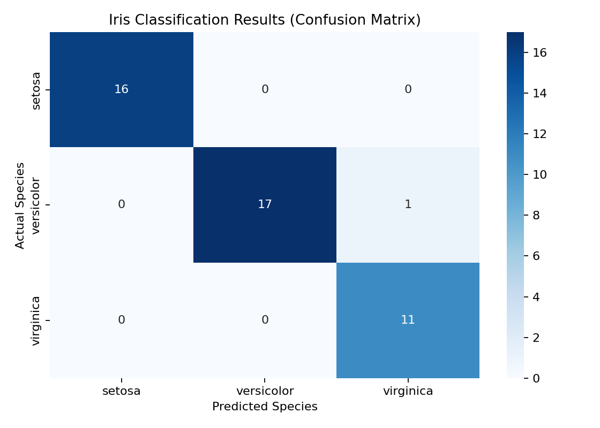
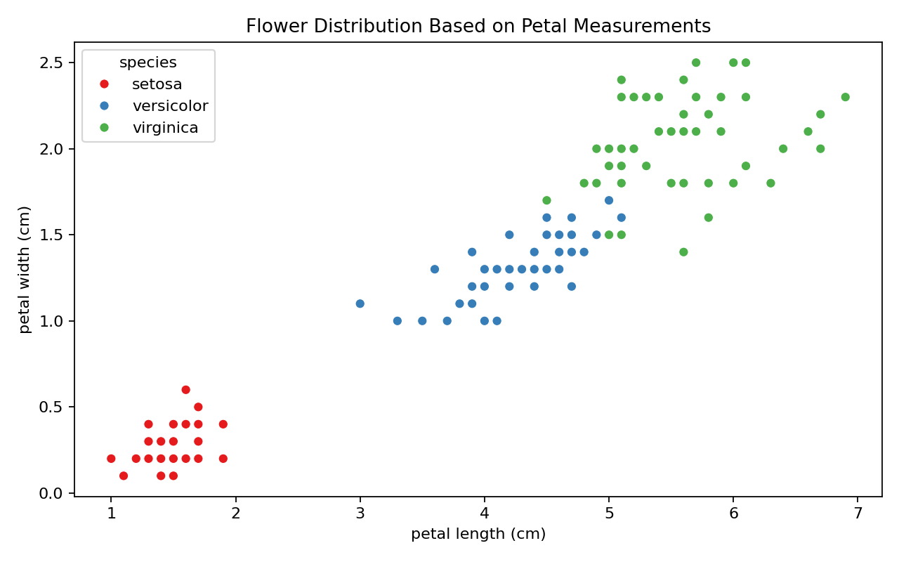
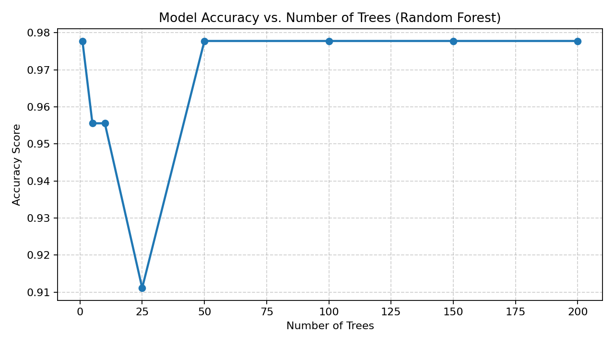
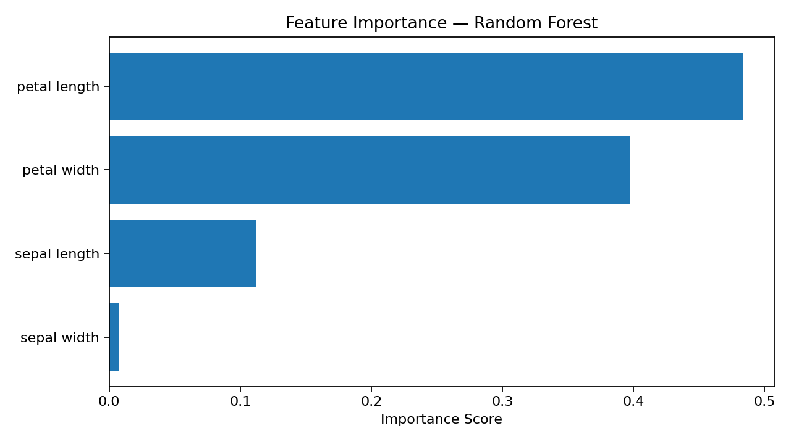

# 🌸 Iris Flower Classification — Machine Learning

A machine-learning project for classifying **Iris flowers** into three species using their sepal and petal measurements. The project uses a **Random Forest classifier** as the main model and also compares it with **Decision Tree** and **Gaussian Naive Bayes**.

## Project Overview

The Iris dataset contains four numeric features for each flower:

- Sepal length
- Sepal width
- Petal length
- Petal width

The target is one of three species:

- `setosa`
- `versicolor`
- `virginica`

The workflow includes data loading, a 70/30 train-test split, model training, prediction, evaluation, and several visualizations.

## Model Performance

Using the provided dataset and the project's train/test configuration (`test_size=0.30`, `random_state=0`), the Random Forest model reaches approximately **98% accuracy** on the test set.

## Visual Results

### Confusion Matrix



### Petal Measurements by Species



### Accuracy vs. Number of Trees



### Feature Importance



## Algorithms

| Algorithm | Purpose |
|---|---|
| Random Forest | Main classification model |
| Decision Tree | Baseline model comparison |
| Gaussian Naive Bayes | Probabilistic model comparison |

## Repository Structure

```text
Iris-Flower-Classification-ML/
├── README.md
├── MLL.py
├── iris_project.ipynb
├── iris_dataset.csv
├── requirements.txt
├── .gitignore
├── results/
│   ├── confusion_matrix.png
│   ├── petal_scatter.png
│   ├── accuracy_vs_trees.png
│   └── feature_importance.png
└── docs/
    ├── Iris Classification Project_New.pptx
    ├── Iris Flower Classification.pptx
    └── Decoding Machine Learning Metrics.pptx
```

## Installation

Clone the repository and install the required Python packages:

```bash
git clone https://github.com/YazAj/Iris-Flower-Classification-ML.git
cd Iris-Flower-Classification-ML
pip install -r requirements.txt
```

## Run the Python Script

```bash
python MLL.py
```

The script trains the Random Forest classifier, prints the classification report, and displays the project visualizations.

## Run the Jupyter Notebook

```bash
jupyter notebook iris_project.ipynb
```

The notebook is organized to run **top-to-bottom** and includes model evaluation, visualizations, feature importance, and model comparison.

## Technologies Used

- Python
- NumPy
- pandas
- Matplotlib
- Seaborn
- scikit-learn
- Jupyter Notebook

## Learning Objectives

This project demonstrates:

- Preparing a labeled dataset for supervised learning
- Splitting data into training and testing sets
- Training a Random Forest classifier
- Evaluating classification results using accuracy, precision, recall, F1-score, and a confusion matrix
- Visualizing class separation using petal measurements
- Studying Random Forest performance as the number of trees changes
- Measuring feature importance
- Comparing multiple classification algorithms

## Dataset

The repository includes `iris_dataset.csv`, containing Iris flower measurements and species labels used by the project.

---

Built as a practical machine-learning classification project using the Iris dataset.
